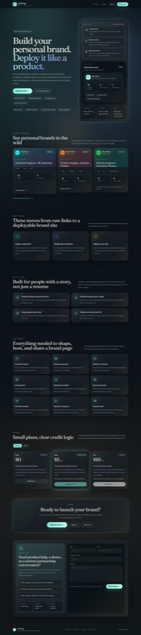
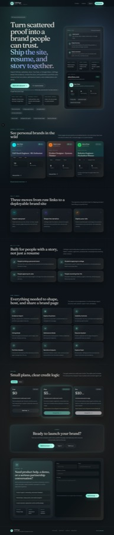
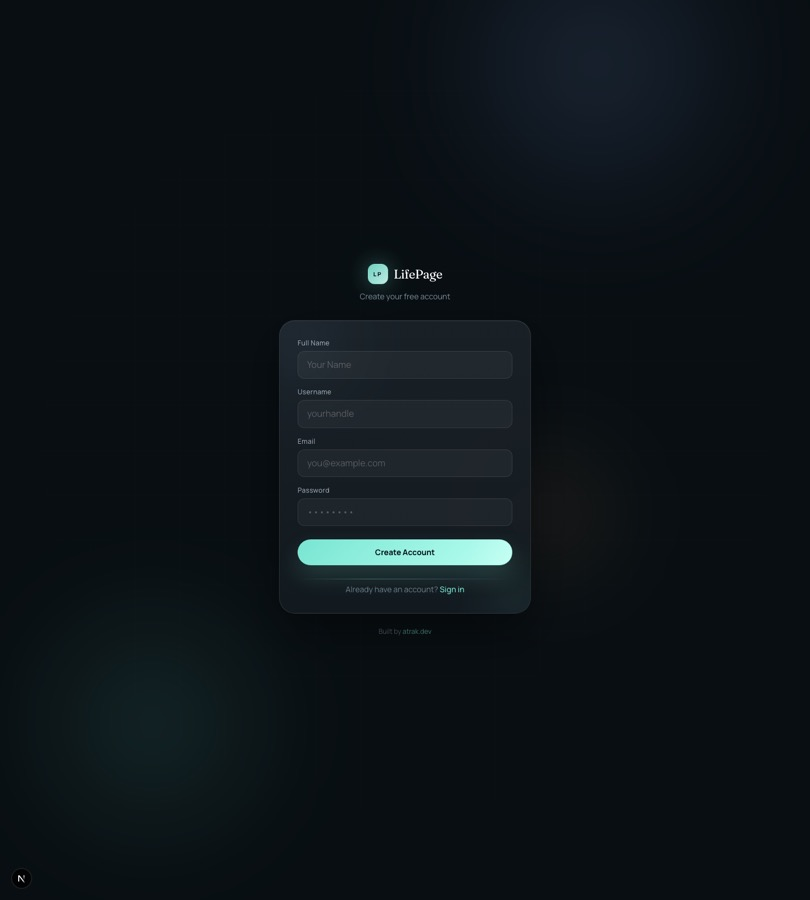
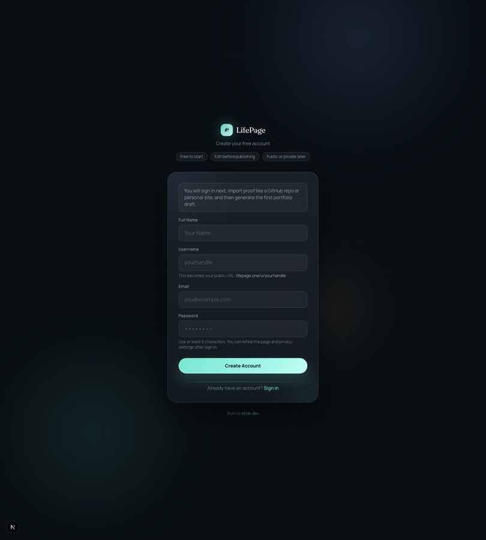
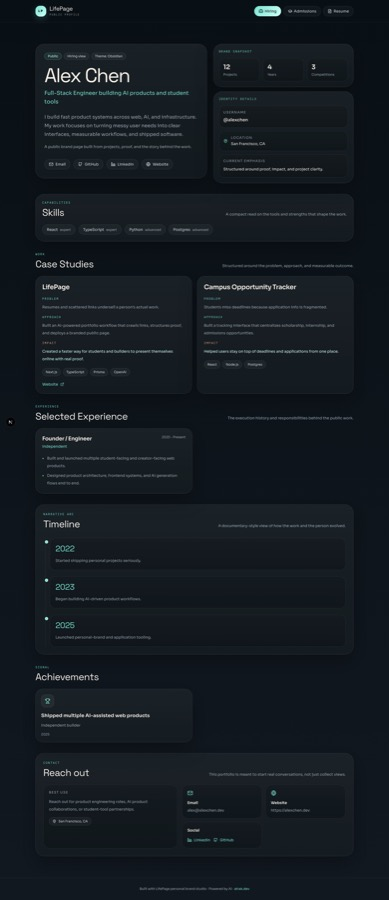
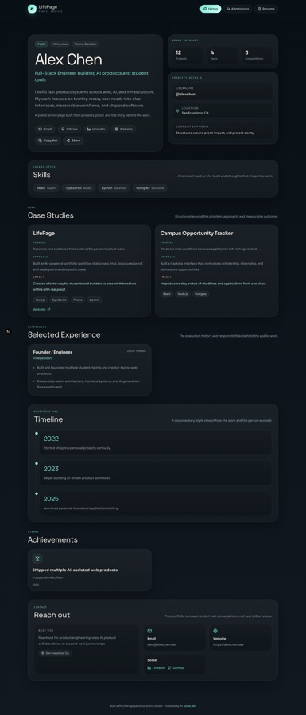
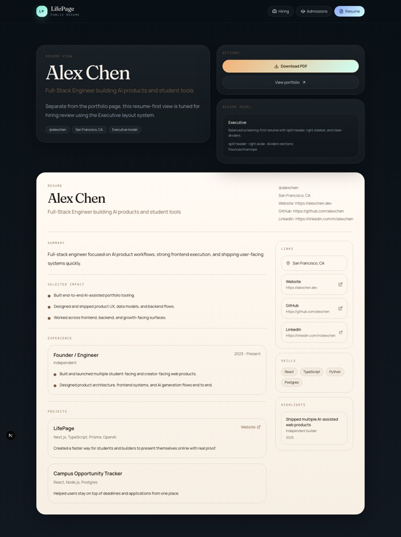
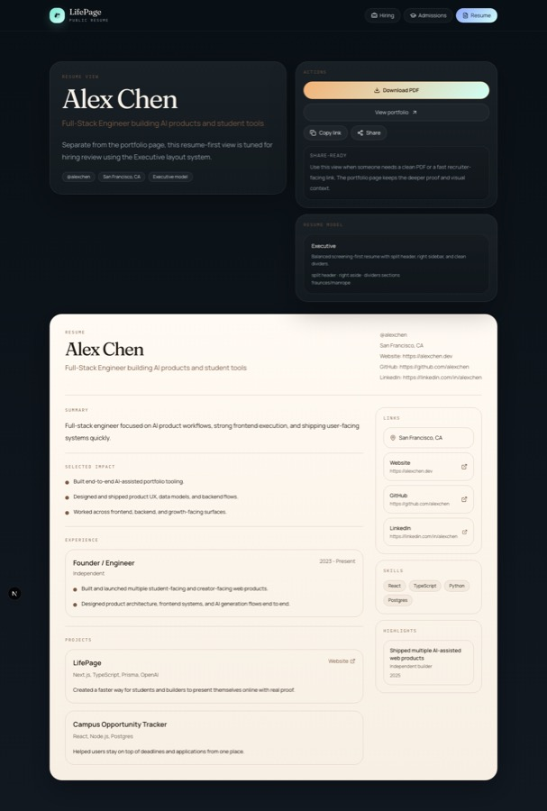

# Post-Launch Sprint 1

## Goals
- Improve conversion on the landing page.
- Improve first-run onboarding clarity.
- Improve credibility on public-facing surfaces.
- Improve perceived performance.
- Improve shareability and measurement.

## What shipped

### 1. Conversion and trust upgrades
- Reframed the landing hero around proof, trust, and shipping instead of a generic portfolio-builder pitch.
- Tightened CTA hierarchy with tracked primary sign-up links and stronger supporting copy.
- Added trust chips and clearer value framing around free start, privacy controls, and edit-before-publish workflow.
- Replaced remaining lettered brand placeholders in core entry surfaces with the wordless brand mark.

### 2. Lower-friction first run
- Added clearer onboarding guidance on register, login, and dashboard.
- Added example source cards for first import on the dashboard.
- Added stronger empty states for no imported evidence and no generated profile.
- Added more explicit progress and error states for crawl and generate actions.
- Improved registration and login error messaging so failures are user-readable instead of raw API text.

### 3. Public page credibility and sharing
- Added share actions to public profile and resume pages.
- Added structured data to the landing page, explore page, public profile pages, and public resume pages.
- Strengthened public project presentation with a proof-oriented display and supporting evidence treatment.
- Improved resume/export presentation with clearer resume-first framing.

### 4. SEO and shareability
- Upgraded root and public-page metadata.
- Added generated Open Graph images for the root site and public profiles.
- Verified and preserved sitemap and robots behavior.

### 5. Performance and perceived performance
- Added route loading skeletons for landing, dashboard, explore, public profile, public resume, and resume surfaces.
- Added caching around public page data and public launch feed reads.
- Added lazy image loading and async decoding on public gallery surfaces.

### 6. Measurement
- Added product analytics events for:
  - `signup_cta_clicked`
  - `signup_viewed`
  - `signup_submitted`
  - `signup_completed`
  - `generate_profile_requested`
  - `generate_profile_succeeded`
  - `generate_profile_failed`
  - `public_profile_shared`
- Added an internal metrics ingestion endpoint and backing Prisma model.

## Design notes

### Landing page
- The hero now leads with proof and trust rather than generic “build a site” language.
- CTA order favors “Start free” and de-emphasizes lower-intent secondary actions.
- Trust is established earlier with concrete workflow cues, proof-oriented copy, and more explicit product framing.

### Onboarding
- First-run guidance now tells the user what happens next instead of forcing them to infer the flow.
- Example URLs reduce blank-state hesitation.
- Error states now explain what to do next instead of echoing raw backend failures.

### Public pages
- Public profile pages now lean harder into proof, visibility, and share actions.
- Resume pages are cleaner, more recruiter-facing, and more explicit about when to use the resume view versus the portfolio view.

### Performance
- The sprint focused on perceived performance first: loading skeletons, cached public reads, and lazy media.
- Public surfaces are now more resilient when backing data is slow or unavailable.

## Prioritized next issues

### P1
1. Build a product analytics dashboard for funnel and share-rate review. Tracked in [#10](https://github.com/charlie2233/My_portforlio/issues/10).
2. Add import templates and batch source presets for the most common onboarding paths. Tracked in [#11](https://github.com/charlie2233/My_portforlio/issues/11).
3. Add authenticated dashboard walkthrough screenshots and stronger end-to-end onboarding QA in a DB-backed local harness. Tracked in [#12](https://github.com/charlie2233/My_portforlio/issues/12).

### P2
4. Add richer proof modules on public pages, such as quantified outcomes, external validation, and testimonial-style evidence blocks. Tracked in [#13](https://github.com/charlie2233/My_portforlio/issues/13).
5. Add share-preview controls so users can customize title, summary, and cover image before sharing. Tracked in [#14](https://github.com/charlie2233/My_portforlio/issues/14).
6. Add image/video optimization for uploaded media variants instead of relying only on lazy loading. Tracked in [#15](https://github.com/charlie2233/My_portforlio/issues/15).

## Validation
- `npm run lint`
- `npm run build`
- `npm run cf:build`
- `E2E_BASE_URL=http://127.0.0.1:3100 E2E_SERVER_COMMAND=true npm run test:e2e:smoke`

Notes:
- `next build` and `cf:build` were run sequentially because the Cloudflare build script temporarily swaps middleware entrypoints; concurrent execution is unsafe.
- Authenticated dashboard screenshots were not captured in this sprint because the local environment did not have a working Postgres service.

## Before / after screenshots

### Landing
| Before | After |
| --- | --- |
|  |  |

### Register
| Before | After |
| --- | --- |
|  |  |

### Public profile
| Before | After |
| --- | --- |
|  |  |

### Public resume
| Before | After |
| --- | --- |
|  |  |
